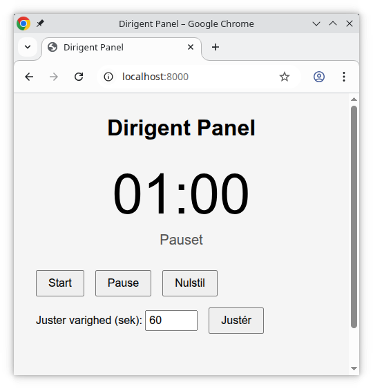
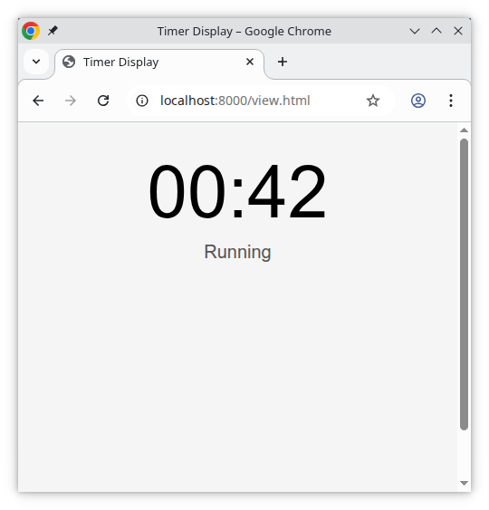

# Frontend Hjemmeopgave: Talerstol Timer Webapp

## Baggrund

I denne opgave skal du bygge en simpel frontend-applikation, der kommunikerer med den medfølgende timer-service.

Applikationen skal understøtte f.eks. konferencer, hvor der afholdes oplæg med meget kort taletid, f.eks. 60 sekunder til 5 minutter. En dirigent styrer taletiden, herunder længden til den pågældende session og skal kunne vise den resterende taletid aktivt til tilhørere og talere, som også selv skal kunne bruge applikationen til at følge med i taletiden.

Applikationen kan også beskrives som en nedtællingstimer der kan styres af een person, men ses af mange på deres mobile enheder.

## Oplæg fra os

Nedenstående oplæg er til inspiration og for at sikre
at du forstår at opgaven er afgrænset. 

## Skærmbilleder til inspiration

Dirigenten har mulighed for at kontrollere timeren og justere tiden

Klienter (viewers) kan kun se timeren. I det her tilfælde kører timeren og der er 42 sekunder tilbage.

## Formål

Formålet med opgaven er at få et indtryk af din evne til:

- Strukturere og bygge en funktionel frontend-løsning
- Arbejde med asynkron kommunikation til en ekstern service
- Demonstrere overordnet teknisk forståelse og valg, herunder designvalg, mv.
- At give os et udgangspunkt at tale ud fra til samtalen

## Foreslået tidsforbrug

Vi anbefaler at du nøjes med at bruge 2 timer på opgaven og fokuserer på det vigtigste for dig.

> **Det betyder også at du kan skære ting fra**, eller tilføje ting.

Fokusér på det du mener er det vigtigste inden for tidsrammen. Skriv gerne i README med noter om dine valg og eventuelle afgrænsninger.

Vi er interesseret i kode, men designovervejelser eller lignende kan også indgå.

## Use Case

- En dirigent kan oprette en ny timer-serie (via servicekald)
- Dirigenten får et link til en styringsside, hvor de kan:
  - Starte, pause og nulstille timeren
  - Ændre taletiden mellem runder
- Der genereres et visningslink, som andre kan tilgå for at se tiden tælle ned
- Flere visninger kan åbnes parallelt (fx på telefoner, skærme)
- Når dirigenten pauser eller starter en timer, vises det på visningerne inden for rimelig tid.

> Tip: Det er næppe muligt at nå at lave en poleret udgave der tilfredsstiller hele ovenstående use case på den tid vi foreslår. En oplagt ting at skære fra er at kunne lave flere timere fra dirigent siden, f.eks. og kun implementere med servicens default timer. Fokuser på minimum viable product (MVP).

## Timer-service

Se beskrivelsen af timer-servicen i [README.md](README.md). Bemærk at serveren er åben for klienter fra localhost:8000 som default.

## Krav og Begrænsninger

- Byg en web-applikation, som anvender timer-service til at:
  - Oprette en ny timer-serie
  - Vise og styre tiden (for dirigenten)
  - Vise nedtælling (for publikum)
- Applikationen skal laves i React og Next
- Du må bruge CSS-rammeværk (f.eks. Tailwind, Bootstrap)
- Applikationen skal kunne afvikles lokalt (opdatér README med instruktioner)
- Sikkerhed, privatliv og skalering er ikke en del af opgaven, men kan være noget vi kan tale om ved samtalen

## Aflevering

En zip/tgz med kildekode med både server og client, mv. 

> **README skal opdateres til at forklare hvordan man kører både service (hvis du har lavet ændringer til dette) og app.**

## Bemærkning om AI / LLM

Vi ved, at moderne sprogmodeller som ChatGPT er let tilgængelige og kan give et markant produktivitetsboost. Vi bruger det selv.

Du er velkommen til at bruge de værktøjer, du normalt ville bruge i dit arbejde, men vi vurderer dig primært på dine egne evner og refleksioner. 
Det er vigtigt, at du selv forstår og kan forklare din kode og dine valg.

